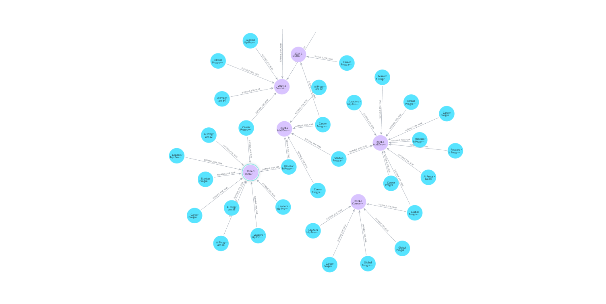
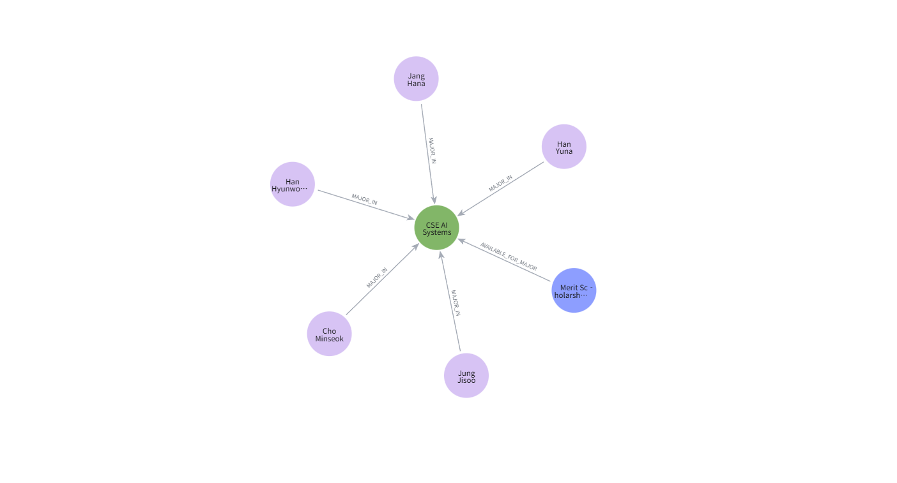
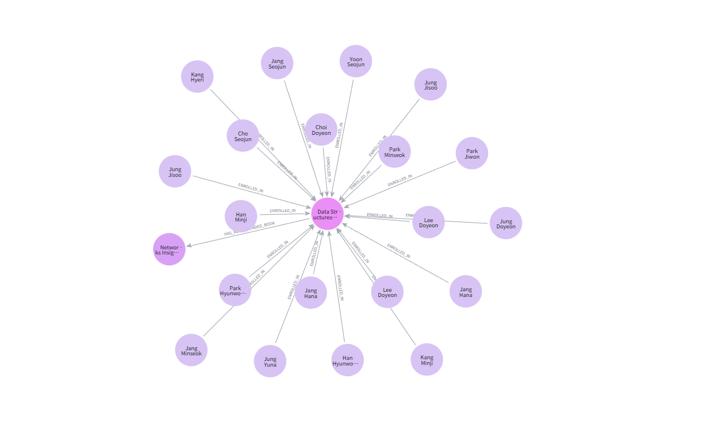

# CBNU Campus Ontology

**충북대 학사·도서관·비교과·장학 데이터를 Neo4j 온톨로지 그래프로 통합해 보는 실험 프로젝트임.**

- **시스템 분산으로 인한 어려움**  
  도서관·학사행정(개신누리)·LMS·비교과(CIEAT)·학과 공지 시스템이 각각 따로 존재함. 동일 학사 흐름(도서–수업–학사 일정–장학)을 한 화면에서 확인하기 어렵고, 서비스 간 교차 참조가 불가능함.

- **학생 관점**

  1. 필요한 정보가 어디에 있는지 구분하기 힘듦 → 학사/장학/비교과/공지 위치가 사이트마다 다름.
  2. 시스템이 전부 독립 운영임 → 과제 자료 찾기, 졸업 요건 확인 같은 단일 업무도 여러 사이트를 거쳐야 함.
  3. 복합/의미 기반 질문(“내가 듣는 과목의 추천도서 중 지금 대출 가능한 책은?” 등)을 자동 처리하기 어려움.
  4. 공지가 메인 홈페이지, 개신누리, LMS, CIEAT, 학과/단과대 공지로 분산되어 일정 누락 위험이 큼.

- **행정 관점**

  1. 이미 게시된 안내라도 반복 문의가 많이 들어와 단순 응대에 시간을 소비함.
  2. 학사·장학·도서관·비교과 데이터가 분리되어 있어 통합 분석/행정 자동화가 어려움. 매번 수작업으로 데이터를 결합해야 함.
  3. 중앙-단과대-학과 공지 시점이 어긋나 전달 누락과 재확인 업무가 발생함.

- 이러한 문제를 해결하기 위해 지식그래프/온톨로지 기반 통합 데이터 모델을 구성함. 도서관·학사행정·LMS·비교과·학과 공지 정보를 하나의 그래프에 연결하여 복합 질의를 처리하고, 학생/행정 모두가 단일 그래프에서 연관 정보를 탐색할 수 있도록 함.

## 1. Ontology & Architecture

### 핵심 노드(Label)

- `Student`, `Professor`, `Course`, `Book`, `NonCurricularProgram`, `Scholarship`
- `AcademicEvent`, `Term`, `Department`, `College`, `MajorTrack`
- `AcademicInfo`, `AcademicActor`, `ScholarlyResource` 등 상위 개념 레이블로 계층 표현

### 주요 관계(Relationship)

- 학사 구조: `(:Student)-[:ENROLLED_IN]->(:Course)`, `(:Course)-[:HELD_IN_TERM]->(:Term)`
- 비교과/장학: `(:Course)-[:RELATED_TO_PROGRAM]->(:NonCurricularProgram)`,
  `(:Scholarship)-[:REQUIRES_PROGRAM]->(:NonCurricularProgram)`
- 조직 구조: `(:MajorTrack)-[:BELONGS_TO]->(:Department)-[:BELONGS_TO]->(:College)`
- 학사일정: `(:NonCurricularProgram)-[:SUITABLE_FOR_YEAR]->(:AcademicEvent)`,
  `(:AcademicEvent)-[:RELATED_TO_COURSE]->(:Course)`

### 데이터 규모(샘플)

- 학생 5,600명 / 과목 260개 / 비교과 100개 / 장학금 50개 / 단과대 5개 / 학과 20개 / 학사일정 40개
- 모든 관계는 `UNWIND` 기반 배치로 생성되며 `id` 속성에 유니크 제약을 부여

---

## 2. Repository Layout

```
cbnu-campus-ontology/
├── cbnu_ontology_poc/
│   ├── src/                # ontology schema, loaders, graph builder, query modules
│   ├── tests/              # pytest 단위/통합 테스트 + fake Neo4j 클라이언트
│   ├── data/               # CSV 샘플 데이터
│   └── neo4j_loader.py     # 대규모 그래프 생성·적재 스크립트
└── README.md               # 본 문서
```

---

## 3. Getting Started

### Requirements

- Python 3.11+
- Neo4j 5.x (Aura Free 또는 Desktop)
- pip / virtualenv

```powershell
python -m venv .venv
.\.venv\Scripts\activate
pip install -r requirements.txt
```

### 3.1 Prerequisites

- Python 3.11+
- Neo4j Aura Free 또는 로컬 Neo4j 5.x
- Poetry/venv 등 가상환경(선택)

### 3.3 데이터 적재

```powershell
cd cbnu-campus-ontology/cbnu_ontology_poc
python neo4j_loader.py
```

출력 메시지 `Sample data loaded. Execute pytest to run query validations.` 가 나타나면
Neo4j 브라우저에서 바로 그래프를 조회할 수 있습니다.

---

## 4. Testing

`tests/` 디렉터리에는 두 범주의 테스트가 있습니다.

- **기존 단위 테스트**: ETL과 그래프 빌더를 `FakeNeo4jClient` 로 검증 (`pytest tests/`)
- **Neo4j 통합 테스트**: `tests/test_neo4j_loader_integration.py`
  - 추천 도서 질의, 트랙-비교과-장학 번들, 졸업 요건 스냅샷, 노드/관계 요약을 검증

실행 방법:

```powershell
pytest
```

---

## 5. Sample Graph Views

아래 이미지는 Neo4j Browser에서 추출한 주요 시각화 예시입니다.

1. **교과·비교과 프로그램 – 학사일정**  
   `docs/images/program.png`  
     
   학기별 이벤트(수강신청, 중간/기말고사 등)를 중심으로, 주변에 Career/Leadership/Research 등 프로그램 노드를 연결했습니다. 일정별 프로그램 밀도를 한눈에 확인할 수 있습니다.

2. **학생 – 과목 – 도서 – 장학 전체 구조**  
   `docs/images/all.png`  
     
   학생 수강, 추천 도서, 비교과, 장학금이 어떻게 묶이는지 전체 망을 보여줍니다. 실제 운영 데이터로 확장 시 구조적 병목이나 고립된 하위 그래프를 찾는 데 유용합니다.

3. **전공 – 장학 – 학생**  
   `docs/images/student.png`  
     
   `CSE AI Systems` 전공 노드를 중심으로 학생과 장학 제도가 동시에 연결된 모습입니다. 특정 전공 학생에게 열려 있는 장학 옵션을 즉시 탐색할 수 있습니다.

4. **과목 – 학생 수강 관계**  
   `docs/images/datastructure.png`  
     
   `Data Structures` 과목을 기준으로 실제 이름을 가진 학생들이 어떻게 묶이는지 보여줍니다. 공동 수강생 네트워크, 인기 과목 분석 등에 활용 가능합니다.

5. **단과대 – 전공/학과 조직도**  
   `docs/images/college_department.png`  
     
   단과대/스쿨 노드와 그 아래 학과·융합 전공을 연결해 조직 구조를 네트워크 형태로 시각화했습니다.
