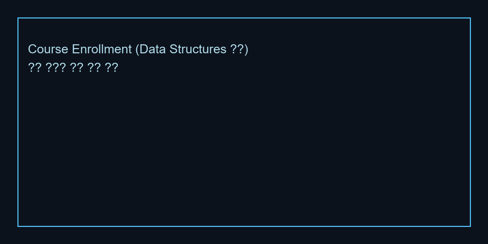

# CBNU Campus Ontology / Knowledge Graph

충북대학교 학사·도서관·비교과·장학·학사일정을 하나의 지식그래프로 통합하기 위한
연구/실험 저장소입니다. `neo4j_loader.py` 스크립트로 대규모 샘플 데이터를 생성하고
Neo4j 5.x 에 적재한 뒤, pytest 기반 시나리오 테스트로 구조를 검증합니다.

---

## 1. Ontology & Architecture

### 핵심 노드(Label)
- `Student`, `Professor`, `Course`, `Book`, `NonCurricularProgram`, `Scholarship`
- `AcademicEvent`, `Term`, `Department`, `College`, `MajorTrack`
- `AcademicInfo`, `AcademicActor`, `ScholarlyResource` 등 상위 개념 레이블로 계층 표현

### 주요 관계(Relationship)
- 학사 구조: `(:Student)-[:ENROLLED_IN]->(:Course)`, `(:Course)-[:HELD_IN_TERM]->(:Term)`
- 비교과/장학: `(:Course)-[:RELATED_TO_PROGRAM]->(:NonCurricularProgram)`,
  `(:Scholarship)-[:REQUIRES_PROGRAM]->(:NonCurricularProgram)`
- 조직 구조: `(:MajorTrack)-[:BELONGS_TO]->(:Department)-[:BELONGS_TO]->(:College)`
- 학사일정: `(:NonCurricularProgram)-[:SUITABLE_FOR_YEAR]->(:AcademicEvent)`,
  `(:AcademicEvent)-[:RELATED_TO_COURSE]->(:Course)`

### 데이터 규모(샘플)
- 학생 5,600명 / 과목 260개 / 비교과 100개 / 장학금 50개 / 단과대 5개 / 학과 20개 / 학사일정 40개
- 모든 관계는 `UNWIND` 기반 배치로 생성되며 `id` 속성에 유니크 제약을 부여

---

## 2. Repository Layout

```
cbnu-campus-ontology/
├── cbnu_ontology_poc/
│   ├── src/                # ontology schema, loaders, graph builder, query modules
│   ├── tests/              # pytest 단위/통합 테스트 + fake Neo4j 클라이언트
│   ├── data/               # CSV 샘플 데이터
│   └── neo4j_loader.py     # 대규모 그래프 생성·적재 스크립트
└── README.md               # 본 문서
```

---

## 3. Getting Started

### 3.1 Prerequisites
- Python 3.11+
- Neo4j Aura Free 또는 로컬 Neo4j 5.x
- Poetry/venv 등 가상환경(선택)

### 3.2 환경 변수
```powershell
$env:NEO4J_URI = "neo4j+s://<your-instance>.databases.neo4j.io"
$env:NEO4J_USER = "neo4j"
$env:NEO4J_PASSWORD = "<password>"
$env:NEO4J_DATABASE = "neo4j"
```

### 3.3 데이터 적재
```powershell
cd cbnu-campus-ontology/cbnu_ontology_poc
python neo4j_loader.py
```
출력 메시지 `Sample data loaded. Execute pytest to run query validations.` 가 나타나면
Neo4j 브라우저에서 바로 그래프를 조회할 수 있습니다.

---

## 4. Testing

`tests/` 디렉터리에는 두 범주의 테스트가 있습니다.

- **기존 단위 테스트**: ETL과 그래프 빌더를 `FakeNeo4jClient` 로 검증 (`pytest tests/`)
- **Neo4j 통합 테스트**: `tests/test_neo4j_loader_integration.py`
  - 추천 도서 질의, 트랙-비교과-장학 번들, 졸업 요건 스냅샷, 노드/관계 요약을 검증

실행 방법:
```powershell
pytest
```

---

## 5. Sample Graph Views

아래 이미지는 Neo4j Browser에서 추출한 주요 시각화 예시입니다.
이미지 파일은 `docs/images/` 아래에 저장해 README와 함께 관리하세요.

1. **교과·비교과 프로그램 – 학사일정**  
   `docs/images/program_timeline.png`  
     
   학기별 이벤트(수강신청, 중간/기말고사 등)를 중심으로, 주변에 Career/Leadership/Research 등 프로그램 노드를 연결했습니다. 일정별 프로그램 밀도를 한눈에 확인할 수 있습니다.

2. **학생 – 과목 – 도서 – 장학 전체 구조**  
   `docs/images/global_student_course.png`  
     
   학생 수강, 추천 도서, 비교과, 장학금이 어떻게 묶이는지 전체 망을 보여줍니다. 실제 운영 데이터로 확장 시 구조적 병목이나 고립된 하위 그래프를 찾는 데 유용합니다.

3. **전공 – 장학 – 학생**  
   `docs/images/major_scholarship.png`  
     
   `CSE AI Systems` 전공 노드를 중심으로 학생과 장학 제도가 동시에 연결된 모습입니다. 특정 전공 학생에게 열려 있는 장학 옵션을 즉시 탐색할 수 있습니다.

4. **과목 – 학생 수강 관계**  
   `docs/images/course_enrollment.png`  
     
   `Data Structures` 과목을 기준으로 실제 이름을 가진 학생들이 어떻게 묶이는지 보여줍니다. 공동 수강생 네트워크, 인기 과목 분석 등에 활용 가능합니다.

5. **단과대 – 전공/학과 조직도**  
   `docs/images/college_department.png`  
     
   단과대/스쿨 노드와 그 아래 학과·융합 전공을 연결해 조직 구조를 네트워크 형태로 시각화했습니다.

> **Note**: README의 이미지 경로는 참조 예시입니다. 실제 PNG 파일을 `docs/images/`에 저장한 후 경로를 맞춰 사용하세요.

---

## 6. Future Work
- 실제 학사 시스템/도서관/비교과 API 연동
- 그래프 임베딩·추천 모델 학습 (분석 3.2 단계 확장)
- 사용자 질의 인터페이스 및 대시보드 구축

---

## 7. Credits
- 2022041052 김금영 (정보통신경영)  
  온톨로지 설계, 데이터 모델링, Neo4j 구축 및 시각화
